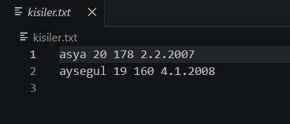
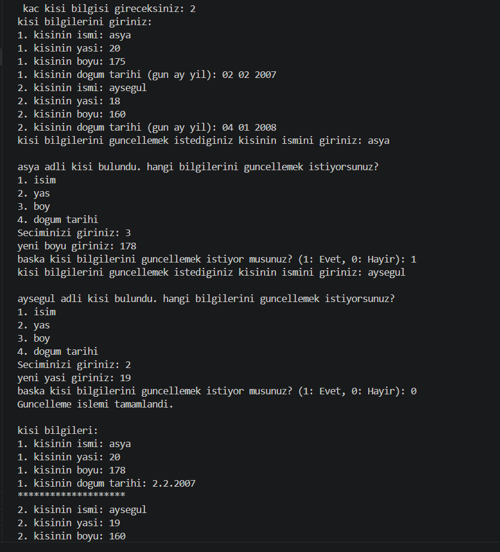

# Kişi Yönetim Sistemi (C)

Bu proje C dilinde geliştirilmiş basit bir kişi yönetim sistemidir.

## Özellikler

- Kişi ekleme
- Kişi güncelleme
- Kişileri listeleme
- Bilgileri dosyaya kaydetme

## Kullanılan Konular

- Struct
- Pointer
- Dynamic Memory (malloc/free)
- Dosya İşlemleri
- String İşlemleri
- Fonksiyonlar

## Derleme

```bash
gcc main.c -o program
```

## Çalıştırma

```bash
./program
```
## Program Görünümü

### Ana Menü



### Program Çalışırken


